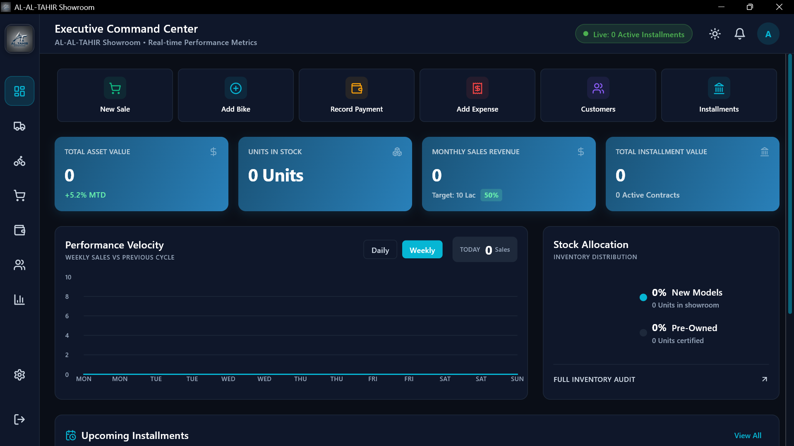
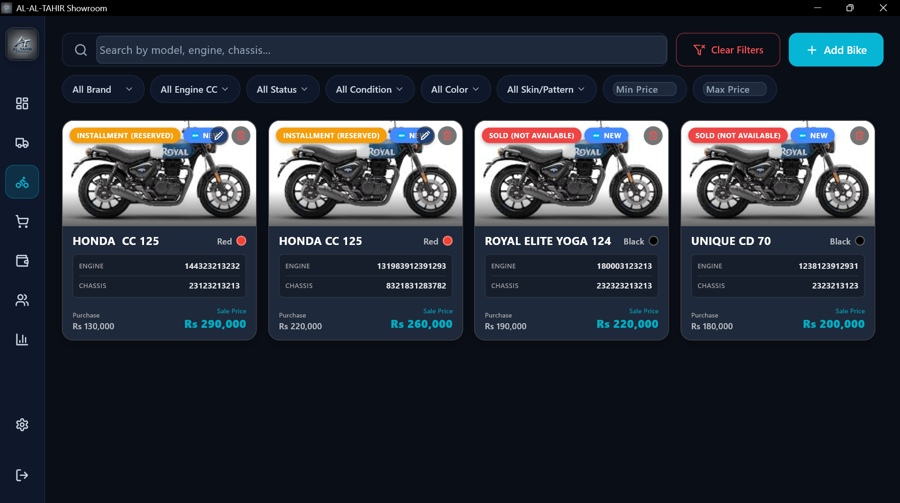
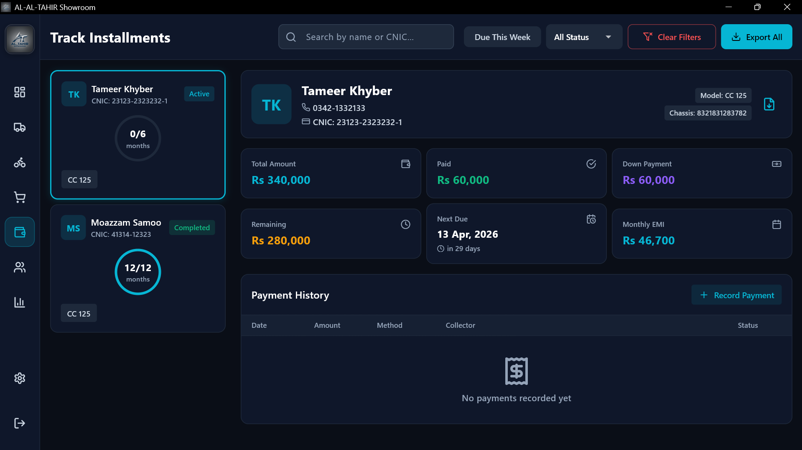
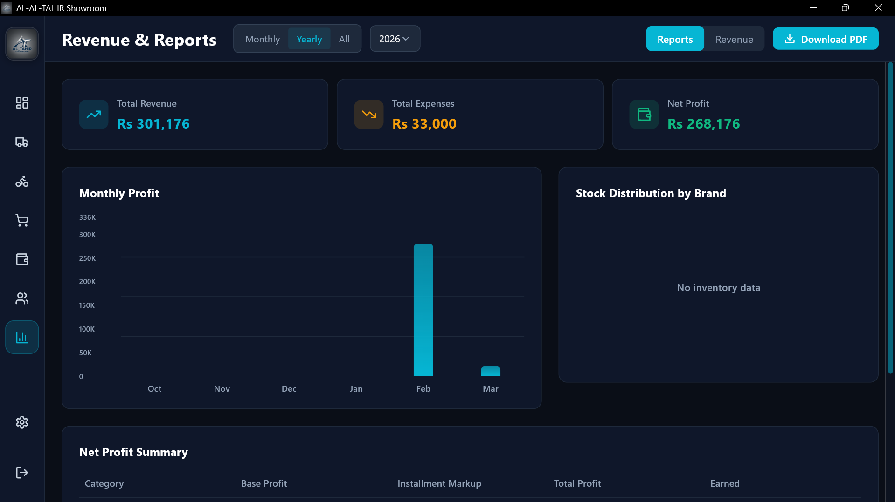

<div align="center">
  
  <br/>
  <h1>🏍️ AL-TAHIR Showroom ERP</h1>
  
  <p>Comprehensive Automotive Inventory & Installment Management System</p>
</div>

<p align="center">
  <a href="#-overview">Overview</a> •
  <a href="#-key-features">Features</a> •
  <a href="#-tech-stack">Tech Stack</a> •
  <a href="#-screenshots">Screenshots</a> •
  <a href="#-installation">Installation</a>
</p>

<p align="center">
  
</p>

---

## 📌 Overview

**AL-TAHIR Showroom** is a tailored, high-performance desktop application designed specifically for modern automotive and motorcycle dealerships. Built using **Flutter** and **Dart** for a buttery-smooth UI, and leveraging **C++** for native Windows integrations, this ERP system centralizes the complexities of inventory tracking, point-of-sale (POS) operations, and long-term installment accounting into one beautifully crafted interface.

## ✨ Key Features

- 📦 **Smart Inventory Management**: Track vehicles by Chassis and Engine numbers. Real-time availability status for Available, Sold, or Installment stock.
- 💳 **Advanced Installment Tracking**: Automate monthly EMI calculations, generate dynamic payment schedules, alert staff about overdue accounts, and utilize intuitive number formatting for inputs.
- 💰 **Comprehensive POS**: Seamlessly handle Cash and Installment sales workflows with automated contract generation.
- 📊 **Real-time Analytics Dashboard**: Executive KPIs, total asset value breakdowns, performance metrics, and professional graphical reporting.
- 🌙 **Adaptive UI/UX**: State-of-the-art Glassmorphism UI, smooth micro-animations, and full Dark/Light mode support.
- 🖨️ **Invoice & PDF Generation**: Built-in native print support for cash receipts, installment contracts, and refined system reports.
- 🔒 **Backup & Recovery**: Automated `.tahir` ZIP backups via Isar database dumping.
- 🛡️ **Hardware Security**: Device locking mechanisms via strict physical MAC address verification to prevent unauthorized duplication and execution.

---

## 🛠 Tech Stack

| Technology | Purpose |
|------------|---------|
|  **Flutter** | Cross-platform UI Framework for fluid desktop rendering |
|  **Dart** | Core programming language for business logic & multi-threading |
|  **C++** | Native Windows desktop integration (Window Manager & Tray) |
| 🗄️ **Isar Database** | Blazing fast, NoSQL local database tailored for Flutter |
| 📊 **FL Chart** | Highly customizable data visualization & graphical metrics |
| 🔔 **Local Notifier** | Native OS-level notifications for overdue payments |

---

## 📸 Screenshots

### Executive Dashboard
> *Real-time KPI metrics, graphical asset tracking, and recent transactions.*
<p align="center">
  
</p>

### Inventory Management
> *Track engine/chassis numbers, filter models, and monitor available units.*
<p align="center">
  
</p>

### Installment Contracts
> *Handle comprehensive multi-month contracts, penalty tracking, and EMI ledgers.*
<p align="center">
  
</p>

### Reporting & Analytics
> *Filterable reports tracking revenue vs. expenses to measure net profit.*
<p align="center">
  
</p>

*(Note: Actual user data hidden/anonymized in system previews for internal safety)*

---

## 🚀 Installation & Build Requirements

*Because this application uses secure, localized Isar storage and native Windows APIs, ensure the following is installed on your workstation:*

1. **Flutter SDK**: `^3.2.0`
2. **Visual Studio build tools** (with C++ Desktop Development enabled)
3. **Dart SDK**: `^3.2.0`

### Running Locally

```bash
# Clone the repository
git clone https://github.com/your-repo/tahir_showroom.git

# Navigate to directory
cd tahir_showroom

# Install required Dart packages
flutter pub get

# Generate Isar Schema maps (Required for DB runtime)
dart run build_runner build -d

# Run the app natively on Windows
flutter run -d windows
```

### Building for Production

To compile a highly optimized, obfuscated, and release-ready Windows executable (which secures hardcoded lists like authorized MAC addresses):

```bash
flutter build windows --release --obfuscate --split-debug-info=build/debug-info
```
The compiled `.exe` and associated DLL dependencies will be located in `build\windows\x64\runner\Release\`.

#### Creating the Installer
Once the production build is finished, use **Inno Setup** to package the application.
Open `installer/setup.iss` in Inno Setup Compiler and compile it to generate a redistributable `ALTahirShowroom_Setup_v1.0.0.exe` file.

---

## 🔐 Security & Privacy Practices

This software handles sensitive financial and customer metadata.
- **Hardware Authorization (MAC Licensing)**: The application checks the system's physical MAC address during the startup sequence. Unauthorized devices are physically gated behind an inescapable lock screen protecting all local APIs from initializing.
- **No Hardcoded Credentials**: Administrative credentials are obfuscated and stored securely using `crypto` SHA-256 protocols. They are never kept statically in the source code.
- **Binary Obfuscation**: Production binaries are compiled using Flutter's native obfuscation protocols (`--obfuscate`) to scramble reverse-engineering attempts of sensitive constants.
- **Local Isolation**: All customer profiles and business ledgers are securely stored locally inside the application's secure application data directories using Isar indexing.
- **DO NOT commit `*.isar` or `.tahir` backup files to version control.**

---

<p align="center">
  <i>Developed specifically for AL-TAHIR Showroom operations.</i><br/>
  <b>Built and Created by Creative District.</b>
  <br/>
  Developers <b>Moazam Samoo</b> & <b>Tameer Ahmed Khyber</b>
</p>
