# Showroom Pulse ERP - Senior Engineering Architecture & Flow Review

## Executive Summary
This document presents the architectural blueprint and operational workflow of the Showroom Pulse Enterprise Resource Planning (ERP) system. Designed to mitigate the operational inefficiencies of manual showroom management, this system provides a centralized, offline-first digital infrastructure for inventory tracking, sales orchestration, customer relationship management (CRM), and advanced financial forecasting. 

Developed utilizing the Flutter framework for cross-platform desktop compilation, the application leverages GetX for reactive state management and the Isar NoSQL database for ultra-low latency, ACID-compliant local storage. The system enforces strict role-based access control (RBAC), cryptographic data security, and dynamic document generation, resulting in a highly resilient, enterprise-grade solution that optimizes vehicular asset valuation and streamlines operational throughput.

<div style="page-break-after: always;"></div>

## 1. Core Architecture & Technical Methodology
*This system was engineered as a high-performance, offline-first Desktop ERP, prioritizing data integrity and real-time responsiveness.*

### Framework & Platform
- **Framework:** Flutter Desktop Native (Windows). Utilizes `window_manager` for custom window controls and `local_notifier` for native OS system alerts, ensuring seamless desktop integration.

### State Management & Routing
- **Architecture:** GetX (`get: ^4.7.2`). 
- **Justification:** Implements strict separation of concerns (MVC/MVVM paradigm). Business logic is entirely encapsulated within `GetxControllers`, ensuring the presentation layers remain declarative and fully reactive. Global state mutations (e.g., capital injections) trigger instantaneous, stream-based localized rebuilds across the application without relying on expensive global state refreshes.

### Database Engine (Offline-First)
- **Architecture:** Isar NoSQL (`isar: ^3.1.0+1`).
- **Justification:** Selected for its exceptional read/write throughput, ACID compliance, and strong static typing via code generation (`isar_generator`). The offline-first methodology guarantees 0ms latency for critical CRUD operations and eliminates operational downtime caused by external network instability.

### Security & Data Integrity
- **Authentication:** Offline SHA-based cryptographic hashing utilizing the `crypto` package.
- **Session Management:** Secure token storage mechanisms via `shared_preferences`.
- **Data Preservation:** Integrated administrative routines to `archive` and securely export `.isar` database states to external physical drives, mitigating data loss risks.

### Dynamic Rendering & Reporting
- **Data Visualization:** High-performance, reactive data rendering utilizing `fl_chart`.
- **Document Generation:** Autonomous local rendering of legally binding Sales Contracts and PDF Invoices via the `pdf` and `printing` packages, effectively eliminating reliance on external server-side rendering pipelines.

<div style="page-break-after: always;"></div>

## 2. Exhaustive Application Routing (System Topology)
*This hierarchical mapping delineates the modular routing logic orchestrated by the navigation framework.*

```text
[App Entry Point -> main.dart]
 ├── [0. Authentication Subsystem (LoginController)]
 │    └── Secure Login Portal -> Cryptographic validation against Isar Admin Records
 │
 ├── [1. Executive Command Center (DashboardController)]
 │    ├── Quick Action Routing
 │    │    ├── New Sale          -> Routes to Sales Management Module
 │    │    ├── Add Bike          -> Routes to Inventory Management Module
 │    │    ├── Investment        -> Routes to Asset Valuation Module
 │    │    ├── Add Expense       -> Routes to Expense Tracking Subsystem
 │    │    ├── Customers         -> Routes to CRM Module
 │    │    └── Installments      -> Routes to EMI Tracking Module
 │    └── Real-time Reactive Metrics (Database Stream Listeners)
 │         ├── Capital Investment & Units in Stock (Automated Low-Stock Triggers)
 │         ├── Monthly Sales Revenue & Target Thresholds
 │         ├── Performance Velocity (Rendered via fl_chart)
 │         └── Stock Allocation Distribution (Categorical Analysis)
 │
 ├── [2. Procurement & Supply Chain Engine]
 │    ├── Supplier Management -> Stateful commits to [SupplierCollection]
 │    └── Batch Processing -> Relational database commits synchronizing Suppliers and Assets
 │
 ├── [3. Inventory Database Interface (InventoryController)]
 │    ├── Dynamic Heuristic Filtering (Regex/Query based)
 │    └── Asset Ingestion Modal
 │         └── Media processing, specification parsing, and [BikeCollection] commits
 │
 ├── [4. Sales Orchestration (SalesController)]
 │    └── Transaction Processing
 │         ├── Foreign Key Mapping (Vehicle -> Customer)
 │         └── Asynchronous PDF Invoice Generation & Local Storage Archival
 │
 ├── [5. Installment & EMI Tracking Engine]
 │    └── Time-Series Metrics -> Automated EMI rounding, late fee penalization, and tenure calculation
 │
 ├── [6. Customer Relationship Management (CustomerController)]
 │    ├── Global Customer Metrics & Active Liability Queries
 │    └── KYC Registration -> Secure processing of CNIC and biometric media uploads
 │
 ├── [7. Financial Aggregation (ReportController)]
 │    └── Macro-Financial Displays -> Algorithmic calculation of Net Profit (Revenue - Expenditure)
 │
 ├── [8. Investment & Asset Valuation]
 │    ├── Asset Valuation Algorithms (Calculating active inventory purchasing parity)
 │    └── Capital Injections/Withdrawals -> Global synchronization of Showroom Liquidity
 │
 ├── [9. System Administration & Security]
 │    ├── Database Subsystem -> Execution of Isar Backup protocols (Export/Import)
 │    └── Localization Subsystem -> Dynamic Theme Toggling & Currency formatting (`intl`)
 │
 └── [10. Application Termination]
      └── Execution of `window_manager` graceful shutdown protocols
```

<div style="page-break-after: always;"></div>

## 3. Visual Storyboard & Technical Implementation Analysis

### 1. Authentication & Security Portal

**Expanded Description & Component Usage Flow:**
The Authentication Portal is the very first touchpoint for any administrator or staff member accessing the Showroom Pulse ERP. It features a clean, dark-themed, centralized login card designed to enforce strict security protocols.
- **Logo & Title Area:** At the top of the login card sits a light blue circular logo containing a bicycle icon. Directly below this is the bold title "Showroom Pulse" accompanied by the descriptive subtitle "Inventory Management System".
- **Username Input Field:** This is a mandatory text field clearly labeled "Username". Inside the input box, there is a user outline icon on the left and a placeholder text reading "Enter your username". This field acts as the primary identifier within the system.
- **Password Input Field:** A secure, masked text field labeled "Password". It features a shield icon on the left side and placeholder text reading "Enter your password". As the user types, the characters are hidden to prevent shoulder surfing.
- **Sign In Button / Authentication Flow:** A prominent, bright cyan button spanning the full width of the form containing the text "Sign In". Once the user has provided both credentials, they click this button to perform a cryptographic validation against the secure local database.
  - *Success Scenario:* If the system verifies the credentials perfectly, the user is instantly navigated to the **Executive Command Center (Dashboard)**.
  - *Error Handling:* If the credentials are incorrect, the system halts the login process and notifies the user to correct their inputs.
- **Footer text:** At the very bottom of the login card, small copyright text reads "© 2024 Showroom Pulse. All rights reserved."

**Technical Implementation:** The authentication portal serves as the primary security gateway, enforcing Role-Based Access Control (RBAC). It implements localized, zero-trust authentication by mathematically hashing user credentials via the `crypto` package, thereby ensuring systemic integrity even in air-gapped environments.

<div style="page-break-after: always;"></div>

### 2. The Executive Command Center
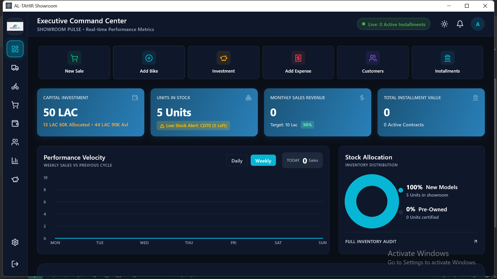
**Expanded Description & Component Usage Flow:**
The Dashboard acts as the central hub of operations, providing a comprehensive, real-time overview of the entire business without needing to dig through menus. The layout is structured logically into distinct functional zones:

- **Header Section:** Features the title "Executive Command Center" with the subtitle "SHOWROOM PULSE - Real-time Performance Metrics". On the far right, there is a green pill-shaped status indicator stating "Live: 0 Active Installments", alongside system icons for a light/dark mode toggle, a notification bell, and a user profile avatar labeled "A".
- **Sidebar Navigation (Left):** A vertical, dark-themed sidebar containing various navigation icons for seamless module switching. The top icon (Dashboard) is highlighted with a cyan border indicating it is the current active screen. Other icons include a truck (Deliveries), bicycle (Inventory), shopping cart (Sales), wallet (Finances), people (CRM), bar chart (Reports), piggy bank (Investments), settings gear, and a logout arrow at the very bottom.
- **Quick Access Navigation Buttons (Top Row):** A horizontal row of six dark-themed shortcut buttons for immediate action without navigating menus:
  - **New Sale:** Features a green shopping cart icon. Instantly navigates to the checkout logic screen.
  - **Add Bike:** Features a blue plus icon. Acts as a shortcut to the Inventory asset ingestion form.
  - **Investment:** Features a yellow/orange piggy bank icon. Navigates to the Asset Valuation module to log capital.
  - **Add Expense:** Features a red receipt icon. Routes directly to the daily Expense tracking subsystem.
  - **Customers:** Features a purple people group icon. Takes the user straight to the CRM directory.
  - **Installments:** Features a teal bank icon. Navigates to the EMI Tracking engine.
- **Summary Metric Cards (KPI Cards - Middle Row):** Four visually distinct, brightly colored cards highlighting critical business metrics at a glance:
  - **CAPITAL INVESTMENT:** Displays a massive value "50 LAC". The subtext breaks this down into "13 LAC 60K Allocated • 44 LAC 90K Avl". It features a small wallet icon in the top right.
  - **UNITS IN STOCK:** Displays "5 Units". Crucially, it features a prominent yellow warning badge stating "Low Stock Alert: CD70 (5 Left)" to notify management. It has a stacked boxes icon.
  - **MONTHLY SALES REVENUE:** Displays "0". It includes a subtext target "Target: 10 Lac" and a green badge indicating "50%" completion. Features a dollar sign icon.
  - **TOTAL INSTALLMENT VALUE:** Displays "0" with a subtext "0 Active Contracts". Features a bank/building icon.
- **Data Visualization Charts (Bottom Row):**
  - **Performance Velocity Chart:** A large line chart spanning most of the bottom area, titled "WEEKLY SALES VS PREVIOUS CYCLE". It plots sales volume (Y-axis 0 to 10) against the days of the week (X-axis MON to SUN). It includes interactive toggle buttons to switch between "Daily" and "Weekly" views, and a grey summary badge showing "TODAY 0 Sales".
  - **Stock Allocation Display:** A specialized donut chart titled "INVENTORY DISTRIBUTION". The visual shows a solid cyan ring representing "100% New Models" (explicitly stating 5 Units in showroom), while "0% Pre-Owned" represents 0 certified units. It includes a quick link arrow at the bottom right pointing to a "FULL INVENTORY AUDIT".
- **Investment Snapshot (Bottom Section):** A specialized widget located at the bottom of the dashboard providing an immediate view into the showroom's financial health:
  - **Available Cash:** Displays the current liquid funds ready to be invested (e.g., Rs. 45,15,000). Features a yellow cash icon.
  - **Net Profit:** Displays the total net earnings (e.g., Rs. 2,10,000) with a green trending-up icon indicating profitability.
  - **Future Payments:** Displays the sum of upcoming installment payments expected (e.g., Rs. 4,25,000 from 1 active contract). Features a blue clock icon.
- **Interactive Tour (Coach Marks):** For new users, an overlay tour highlights the Navigation Menu, Quick Actions, KPIs, and Performance Chart to explain their functionality.

**Technical Implementation:** Functioning as the operational nucleus, the dashboard employs GetX reactive variables (`.obs`) to establish real-time listeners on the Isar database. The Performance Velocity matrix utilizes `fl_chart` to render dynamic data visualizations that automatically recalculate and repaint UI layers instantly upon any underlying database mutation. It also utilizes a NotificationService to dynamically render pending installment alerts in the top app bar.

<div style="page-break-after: always;"></div>

### 3. Procurement & Supply Chain Management
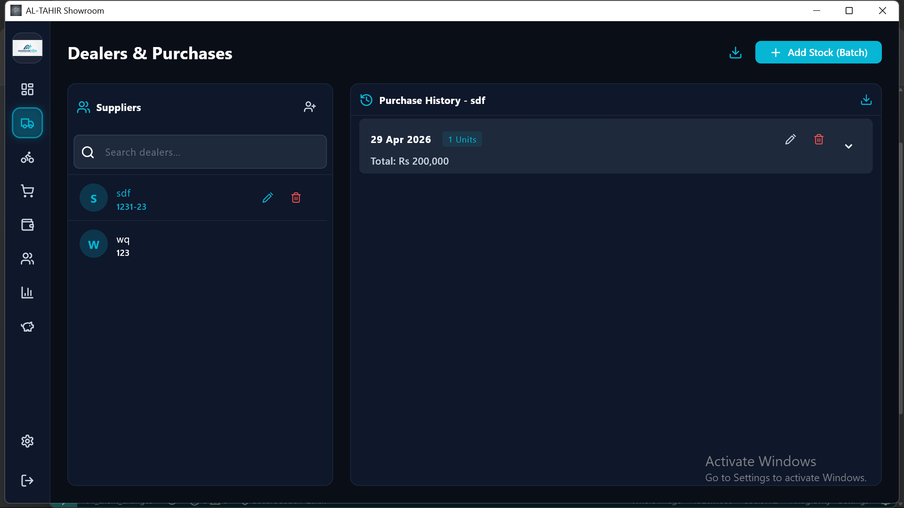
**Expanded Description & Component Usage Flow:**
This screen is entirely dedicated to managing the B2B relationships between the showroom and its wholesale suppliers or dealers. It tracks where the showroom is purchasing its vehicles and how much money is flowing out to acquire stock.
- **Dealers List (Directory):** The main view displays a comprehensive, scrollable directory of all active suppliers, distributors, and dealers.
- **Add Stock / Batch Purchase Form:** When the showroom buys a new batch of bikes, the admin uses this complex, dynamic form to record the transaction.
  - *Supplier Details Tab:* Features a dynamic toggle to select an existing supplier from a dropdown or register a "New Supplier" instantly. If "New Supplier" is selected, fields appear for Supplier Name (Alphabetic only formatting), Phone (using PhoneNumberInputFormatter for 03XX-XXXXXXX), and CNIC (Optional, using CnicInputFormatter). It also provides image upload boxes for Profile Picture and CNIC images.
  - *Batch Invoice Upload:* A dedicated media upload box allowing the admin to attach a physical photograph of the paper invoice received from the dealer.
  - *Dynamic Bike Entry Grid:* The user can click an "Add Row" button to dynamically inject new vehicle entry rows into the batch. Each row requires: Engine Number (max 17 chars), Chassis Number (max 17 chars), Maker (Autocomplete), Horse Power (Autocomplete), Condition (New or Used toggle, which dynamically reveals a "Registration #" field if Used), Color (Interactive Skin Selector), Model Year (Autocomplete), Purchase Price (using ThousandsSeparatorInputFormatter), an Image Upload box, and a Dealer Papers tracking section (Checkbox/Calendar).
  - *Keyboard Navigation:* The entire dynamic grid utilizes a highly advanced nested `BlinkingFocusBuilder` system, allowing rapid, uninterrupted data entry using only the Tab and Arrow keys to jump across multiple bikes.
  - *Confirm & Process Batch Button:* The user clicks this to finalize the bulk ingestion.
  - *Validation Logic:* If everything is correct, the system automatically subtracts the total combined cost from the global cash liquidity pool and synchronously injects all bikes into the Available Inventory. If something is wrong (e.g., a missing engine number in row 3, or price missing), the system completely blocks the transaction and notifies the user to correct the specific inputs in the highlighted rows before allowing the batch commit.

**Technical Implementation:** This module orchestrates batch transactional processing. It ensures ACID compliance during bulk inventory ingestion; when a batch of vehicular assets is recorded, the total capital expenditure is synchronously deducted from the showroom's aggregate liquidity pool, preventing financial discrepancies.

<div style="page-break-after: always;"></div>

### 4. Inventory Database Interface
**Main Inventory View:**
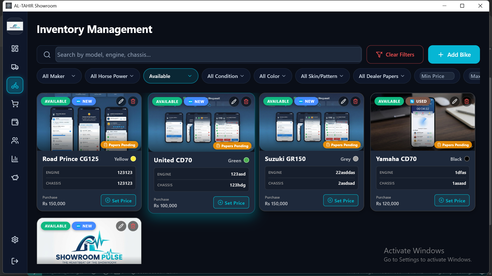
**Expanded Description & Component Usage Flow:**
This screen is the digital warehouse. It allows the user to browse, search, and manage every single vehicle that the showroom owns.
- **Filter Bar & Search:** A highly responsive control bar situated at the top. The user can use the search field to quickly search for specific bikes by simply typing in a partial engine number, a chassis number, or the name of a specific bike model.
  - *Advanced Dropdowns:* These tools enable the user to deeply organize the massive inventory list. Users can filter by Brand, CC, Status (Available, Sold, Reserved), Condition, Color, Skin, Dealer Papers, and set a Min/Max Price. A "Clear Filters" button allows resetting the view instantly.
- **Inventory Grid Items:** The core area displays individual cards for every single bike in a responsive grid layout (adapting columns based on screen width). Each card highlights crucial details like the Make, Model, Color, and the expected Selling Price.
  - *Interactions:* Clicking on an item expands it to reveal deeper technical specifications. The system intelligently disables the 'Edit' function for bikes that are marked as 'Sold', preventing historical data corruption.
- **Add Bike Button:** A prominent action button embedded within the filter bar that, when clicked, opens up the "Asset Ingestion Form" to register a brand new vehicle into the showroom's system.
- **Interactive Tour (Coach Marks):** Upon first visit, a guided overlay highlights the Search & Filters, Add New Bike button, and the Inventory Grid to help new staff acclimate.

**Asset Ingestion Form:**
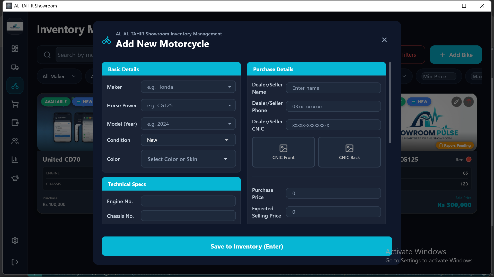
**Expanded Description & Component Usage Flow:**
- **Two-Column Layout:** The form is split into distinct sections for usability. The left side handles physical details, while the right handles financial and legal tracking.
- **Basic Details & Technical Specs (Left Column):**
  - *Autocomplete Fields:* Maker (e.g., Honda), Horse Power (e.g., CG125), and Model Year.
  - *Condition & Colors:* Dropdown for New/Used (which dynamically shows a "Registration #" field if Used) and a dynamic color/skin selector.
  - *Identifications:* Strict fields for Engine Number and Chassis Number, both capped at 17 characters and marked as highly required.
- **Purchase Details (Right Column):**
  - *Dealer/Seller Tracking:* Captures the source of the bike, including Seller Name, Phone number (with automatic formatting), and CNIC (with CNIC formatting).
  - *CNIC Media:* Specific upload boxes for the Dealer's CNIC Front and CNIC Back photos.
  - *Financials:* Exact Purchase Price and Expected Selling Price inputs, separated by commas automatically via `ThousandsSeparatorInputFormatter`.
  - *Dealer Papers Tracking:* A checkbox system to log if original dealer papers are collected, or a calendar picker to set a "Promised Date".
- **Image Upload Area:** A large dedicated section to upload the physical bike's image.
- **Keyboard Navigation & Validation:** The form features an advanced `BlinkingFocusBuilder` allowing the user to seamlessly use arrow keys or Enter to jump between fields. Strict validation prevents saving unless all required fields (and images) are attached.
- **Save Asset Button & Validation Logic:** Once all details are filled out, the user clicks this button to commit the data to the database. 
  - *Validation:* The system will rigorously check the form. If any critical fields (especially unique identifiers like the Engine Number or Chassis Number) are left blank or are formatted incorrectly, the system will prevent the save. It will immediately pop up a notification informing the user exactly which inputs are missing or wrong, forcing them to correct the data to ensure perfect data hygiene before the bike becomes "Available" for sale.

**Technical Implementation:** The asset management layer implements robust input validation to maintain data hygiene. It utilizes the `image` and `file_picker` dependencies to ingest, compress, and archive local media securely via `path_provider`, optimizing database performance by storing media references rather than binary blobs within the primary Isar file.

<div style="page-break-after: always;"></div>

### 5. Sales Orchestration & Contract Generation
**Sales Ledger:**
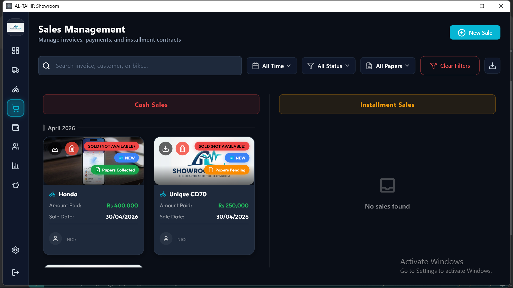
**Expanded Description & Component Usage Flow:**
This is the master record of all commercial transactions. It tracks every bike that has been successfully sold to a customer.
- **Sales Filter Bar:** A top control bar allowing users to filter the massive sales history by date, sale type (Cash vs Installment), or specific customer name.
- **Sales Record Grid:** A responsive grid view showing all historical and active sales cards. Each card displays the purchasing customer's name, the specific details of the bike they bought, the total agreed-upon price, and the exact date and time the sale occurred. Clicking a card reveals invoice details and provides download options.
- **New Sale Button:** Situated prominently in the top header section, clicking this button navigates the user straight to the Checkout Logic screen to initiate a brand new commercial transaction with a customer.
- **Interactive Tour (Coach Marks):** A built-in guided tour specifically highlights the Create New Sale button, Filters & Search bar, and the Sales Records grid.

**Checkout Logic (New Sale Entry Form):**
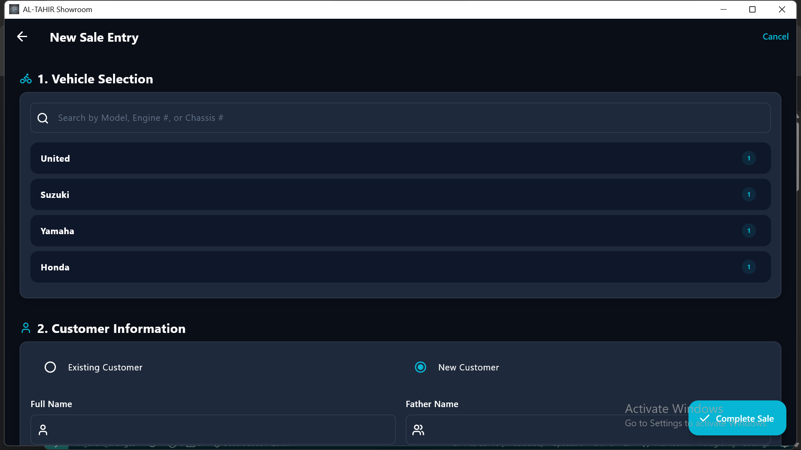
**Expanded Description & Component Usage Flow:**
This intensive 5-step form orchestrates the actual hand-over of an asset to a client. The user navigates seamlessly via Escape/Arrow-key `KeyboardListener` overrides.
- **Step 1: Vehicle Selection:** The user browses through a list of currently 'Available' bikes and clicks to select the specific vehicle.
- **Step 2: Customer Information:** The user defines *who* is buying. They can use an autocomplete searchable dropdown to find an existing profile. If it's a walk-in, the inline form accepts Name, Father Name, CNIC (13 digits), Phone (11 digits), Address, and Media uploads (CNIC Front/Back, Profile Pic).
- **Step 3: Witness Information:** Captures legal guarantors. "Witness 1" is mandatory (requires Name, 13-digit CNIC, Phone, Address, and CNIC Front upload). A dynamic toggle ("Add Witness 2") reveals optional fields for a second guarantor.
- **Step 4: Payment Terms & Contract:** Features a dynamic toggle switch between "Cash Sale" and "Installment".
  - *Cash Sale Mode:* Displays the bike's original price. Provides a "Received Amount (Rs)" input (ThousandsSeparatorInputFormatter). As the user types, it automatically calculates and visually displays a green "Discount Applied" percentage/amount if they receive less than the original price.
  - *Installment Mode:* Unlocks a complex calculator. Allows adding an optional Discount, configuring the Markup Type (Percentage vs Fixed Amount) and Markup Value, setting the Down Payment, and entering the number of Installments (Months). A Live Calculation Result widget instantly updates to show the Monthly EMI, total cost, and markup applied.
- **Step 5: Document Tracking:** Tracks physical paper handling.
- **Complete Sale Button & Validation:** Finalizes the massive workflow.
  - *The Process:* When clicked, if everything is correct, the system permanently links the customer to the asset, marks the bike 'Sold', logs the financial income/receivables, navigates the user back to the sales ledger, and autonomously renders a PDF contract.
  - *Error Handling:* If something is wrong (e.g., Witness CNIC is less than 13 digits, Witness 1 CNIC Front image is missing, or Down Payment exceeds total value), the form blocks submission, jumps focus to the offending field via `BlinkingFocusBuilder`, and notifies the user to correct the inputs before generating the contract.

**Technical Implementation:** This subsystem executes highly complex relational database queries, establishing rigid links between `Bike` (Asset) and `Customer` (Client) entities. It subsequently leverages the `pdf` and `printing` packages to dynamically compile and format legally binding contractual documents based on the verified UI state.

<div style="page-break-after: always;"></div>

### 6. Installment & EMI Tracking Engine
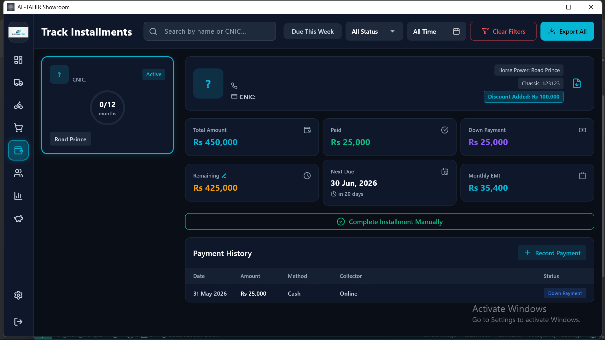
**Expanded Description & Component Usage Flow:**
For showrooms that sell vehicles on lease or credit, this screen is vital for tracking debts and ensuring cash flow remains positive.
- **Top Control Bar & Filters:** The screen features a highly equipped top bar containing:
  - *Search Box:* To quickly find contracts by typing a customer name or CNIC.
  - *Due This Week Pill:* A quick filter toggle that instantly isolates customers whose payments are imminent.
  - *Status & Date Dropdowns:* To filter by contract status (e.g., Active, Overdue, Completed) or timeframe (e.g., This Month, Last 3 Months).
  - *Export All Button:* Allows administrators to download all currently filtered statements into a single, comprehensive batch.
- **Split Layout - Customer List Sidebar:** The left panel provides a comprehensive, scrollable list of all customers bound by an active contract. Clicking a card updates the right panel.
- **Split Layout - Detailed Payment Panel:** The right panel focuses entirely on the selected customer. It features:
  - *Customer Header:* Shows their Avatar, Phone, CNIC, Bike Model/Chassis, and any discounts applied. It includes a specific button to "Download Statement" for just that customer.
  - *Payment Summary Cards:* A grid of cards highlighting Total Amount, Paid Amount, Remaining Balance, Next Due Date, Down Payment, and Monthly EMI. It includes an action to "Apply Discount" on the remaining balance.
  - *Complete Installment Manually Button:* A major admin action to immediately close out a contract if the customer brings in the full remaining cash.
- **Record Payment Dialog:** When a customer arrives to pay their EMI, the admin clicks "Record Payment" opening this specific modal dialog.
  - *Input Fields:* Requires entering the "Amount" (utilizing the ThousandsSeparatorInputFormatter). A dropdown allows selecting the Payment Method (Cash, Bank Transfer, JazzCash, EasyPaisa, Cheque). Optional text fields exist for Collector Name and Notes.
  - *Submit Payment Button & Validation:* 
    - *The Process:* When clicked, if everything is correct, the system logs the transaction, decrements the remaining balance on the contract, updates the next due date automatically, injects the received amount into the global cash pool, and closes the dialog notifying the user of success.
    - *Error Handling:* If something is wrong (e.g., Amount field is empty or contains non-numeric characters), the system shakes the input field, blocks the transaction, and notifies the user to correct the payment inputs.
- **Interactive Tour (Coach Marks):** A guided overlay highlights the Search Bar, Active Contracts list, and Payment Details panel for new users.

**Technical Implementation:** Engineered with localized time-delta computational logic, this module autonomously tracks active liabilities. It algorithmically flags delinquent accounts and applies automated penalties based on the globally configured `Automatic Late Fee %` parameters defined within the system settings.

<div style="page-break-after: always;"></div>

### 7. Customer Relationship Management (CRM)
**Customer Database:**
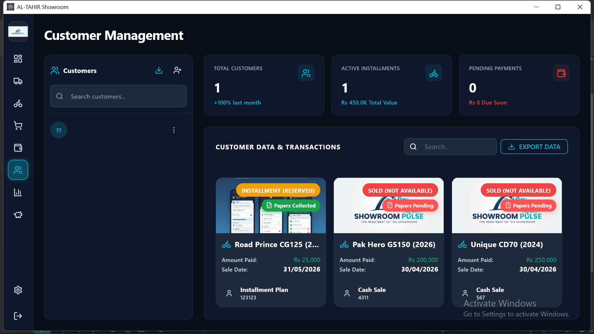
**Expanded Description & Component Usage Flow:**
This module is the master directory for all individuals who interact with the showroom.
- **Split Layout - Customer List Sidebar:** The left panel provides a massive, scrollable directory of every single registered client. It includes a responsive search bar to quickly pull up a specific customer's profile by typing in their name, phone number, or CNIC.
- **Global Download Button:** A powerful feature located at the bottom of the sidebar. When clicked, it exports all customers' data and their associated images into a single ZIP file for external backup or compliance auditing.
- **Add Customer Action:** A primary action button integrated into the sidebar that navigates the user into the specialized KYC Registration Portal to formally onboard a new client.
- **Split Layout - Customer History Panel:** The right panel displays the selected individual's full purchase history, deeply detailed transactions, and allows for the downloading of their specific statements.
- **Interactive Tour (Coach Marks):** Guides the user through the Customer Directory, Global Download button, and Purchase History panel.

**KYC Registration Portal:**
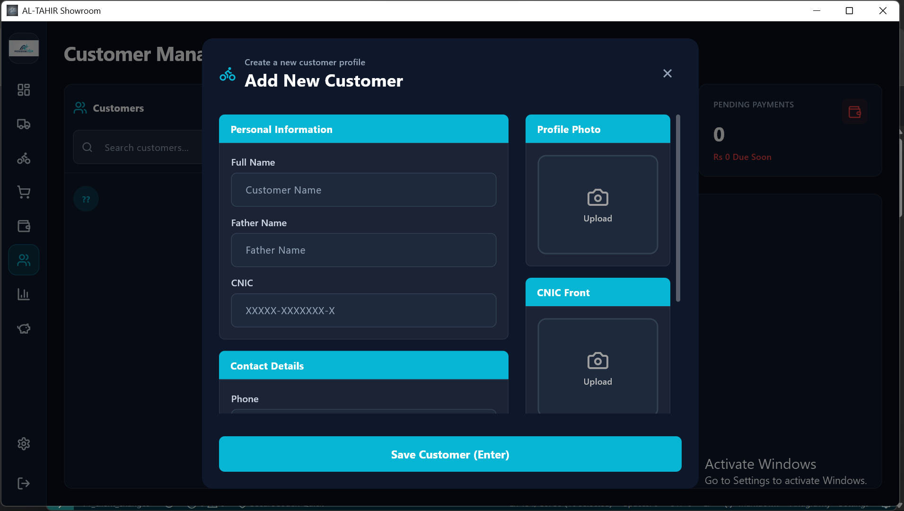
**Expanded Description & Component Usage Flow:**
This form ensures that the showroom legally knows exactly who they are doing business with. It utilizes a split-pane layout to separate text entry from media uploads.
- **Left Column - Personal & Contact Info:**
  - *Personal Information:* Structured text fields for Full Name and Father's Name (restricted to alphabetic characters), and a CNIC field that strictly enforces a 13-digit pattern (XXXXX-XXXXXXX-X).
  - *Contact Details:* A Phone number field enforcing an 11-digit minimum, and a full text area for their Residential Address.
- **Right Column - Mandatory Media Uploads:**
  - *Profile Photo:* Upload box for a facial picture of the customer.
  - *CNIC Front & Back:* Two separate upload boxes explicitly requiring the front and back scans of the identity card.
  - *Undo Action:* A quick action to undo an accidental new image selection.
- **Register Button & Validation Logic:** The user clicks this to save the client's profile to the database.
  - *Validation & Navigation:* Fully operable via keyboard shortcuts. If the user tries to save without attaching *all three* mandatory images (Profile, CNIC Front, CNIC Back) or leaves the 13-digit CNIC incomplete, the system triggers a warning dialog blocking the save until corrected.

**Technical Implementation:** The CRM module facilitates secure Know Your Customer (KYC) onboarding. It establishes a one-to-many relational hierarchy within the Isar database, allowing a single verified client entity to be associated with multiple concurrent installment liabilities and historical transactional records.

<div style="page-break-after: always;"></div>

### 8. Macro-Financial Aggregation
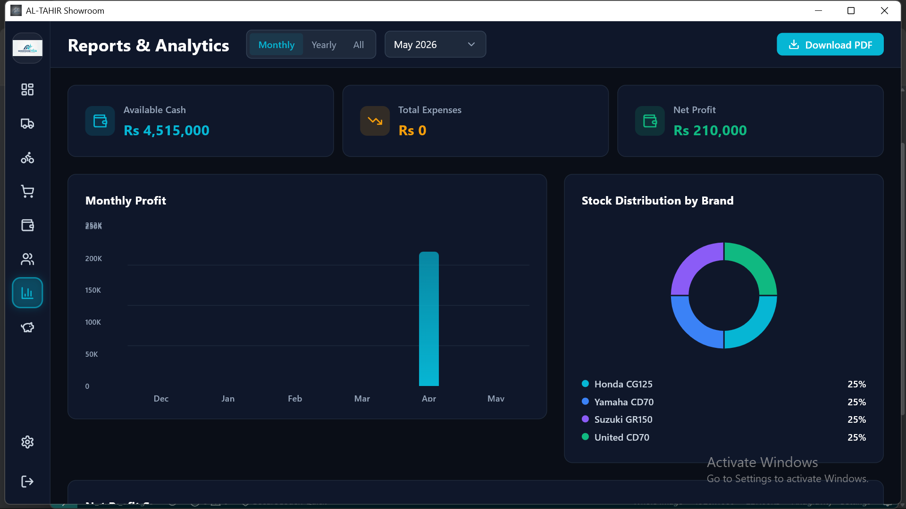
**Expanded Description & Component Usage Flow:**
This screen is the accounting department of the application. It aggregates data from every other module to calculate exactly how much money the business is making or losing.
- **Financial Reports Dashboard:** The central visual element features sophisticated visual charts (like bar graphs and pie charts) and dense data tables. These represent the total gross income (from sales and installments) plotted directly against total operational expenses (dealer purchases, daily bills).
- **Net Profit Indicator:** A massive, prominently displayed numerical metric that calculates `(Total Revenue - Total Expenditures)`. This is the single most important number for the showroom owner, showing their exact net profit in real-time.
- **Date Range Picker:** By default, it might show the current month's data. However, the user can click this tool to select specific timeframes—filtering the entire dashboard to show financial data for a specific Day, a specific Week, a specific Month, or a completely Custom date range to generate highly targeted seasonal reports.
- **Export Report Button:** Recognizing that this data needs to go to external accountants, clicking this button allows the user to instantly generate and export these complex financial summaries as beautifully formatted PDF documents or structured Excel spreadsheets for external use.

**Technical Implementation:** A computationally intensive analytical module designed to aggregate disparate data streams across the Sales, Expenses, and Maintenance collections. It synthesizes these inputs to project an accurate, real-time Net Profit snapshot, formatted strictly via the `intl` currency localization standards.

<div style="page-break-after: always;"></div>

### 9. Investment & Asset Valuation
**Asset Portfolio:**
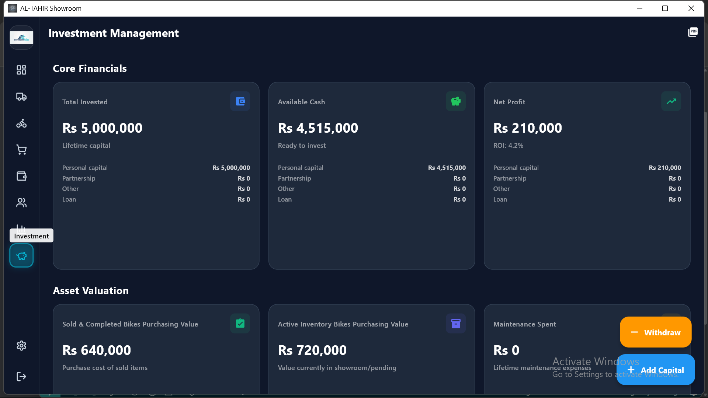
**Expanded Description & Component Usage Flow:**
This module tracks the high-level equity and value of the entire showroom business.
- **Export Report Button:** Located in the top AppBar, clicking this button instantly generates and exports all investment and valuation data into a beautifully formatted PDF report.
- **KPI Dashboard Area (Core Financials & Assets):** A highly detailed, multi-grid section breaking down the showroom's equity:
  - *Core Financials:* Cards displaying "Total Invested" (lifetime capital), "Available Cash" (ready to invest), and "Net Profit" (showing exact profit/loss calculations and ROI percentages). Clicking these cards opens interactive detail popups showing granular category breakdowns.
  - *Asset Valuation:* Cards evaluating the "Sold & Completed Bikes Purchasing Value", "Active Inventory Bikes Purchasing Value" (money locked in physical showroom stock), "Maintenance Spent", and "Total Expenses".
  - *Installment Predictions:* Cards projecting future cash flow by tracking "Future Payments" expected from active contracts and the anticipated "Future Profit".
- **Investment History Ledger:** A complete historical log displaying a chronological list of all capital adjustments. It includes a specialized Investment Filter Bar and a dynamic count indicator (e.g., "45 Records").
- **Floating Action Buttons (FABs):** Two prominently positioned buttons pinned to the bottom right. "Add Capital" (blue) and "Withdraw" (orange) open specific modal dialogs to officially record macro-adjustments to the showroom's primary capital pool.
- **Interactive Tour (Coach Marks):** An introductory overlay tour that explains the core financials, asset valuations, and capital adjustment flows to stakeholders.

**Transaction Handlers (Add Capital / Withdraw Flow):**
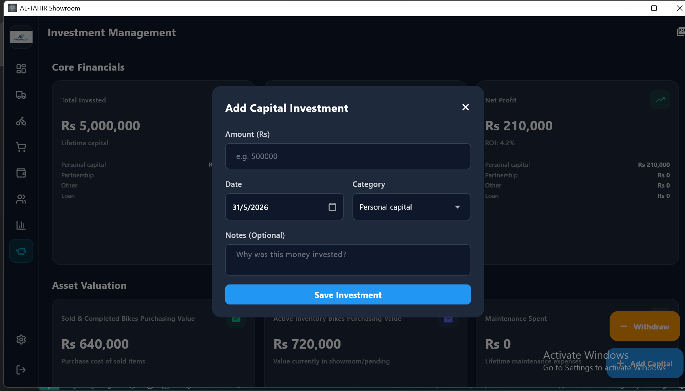
<br/>
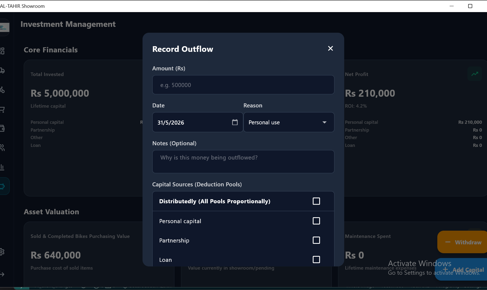
**Expanded Description & Component Usage Flow:**
- **Add Capital Dialog:** Used to inject equity. Requires entering the Amount (Rs) via ThousandsSeparatorInputFormatter, picking an exact Date via a calendar widget, and selecting a specific Category (Personal Capital, Loan, Partnership, Other).
- **Withdrawal Dialog:** Used to record outflows. Requires Amount, Date, and an expense Category (Personal Use, Maintenance, Expense). Critically, it features a "Source Toggle" allowing the admin to define if the withdrawal should be taken "Distributedly (All Pools Proportionally)" or explicitly deducted from a specific capital pool (e.g., only subtract from "Partnership" funds).
- **Notes Field:** A multi-line text area to provide justification for the transaction.
- **Confirm Button & Validation:** Commits the action, updating global liquidity pools.
  - *The Process:* If everything is correct, the system logs the transaction into the historical ledger, mathematically adjusts the total Available Cash/Invested Capital KPI cards in real-time, and navigates the user back to the portfolio screen.
  - *Error Handling:* If something is wrong (e.g., trying to withdraw Rs. 100,000 from a Partnership pool that only has Rs. 50,000, or leaving the amount empty), the system blocks the transaction and triggers a notification that prompts the user to correct their inputs or select a valid withdrawal source to maintain strict financial integrity.

**Technical Implementation:** This predictive financial modeling module evaluates all active liabilities and current inventory parity to forecast "Future Profit" and "Future Payment" inflows. It provides stakeholders with comprehensive liquidity tracking by contrasting total capital investments against operational withdrawals.

<div style="page-break-after: always;"></div>

### 10. System Administration & Database Safety
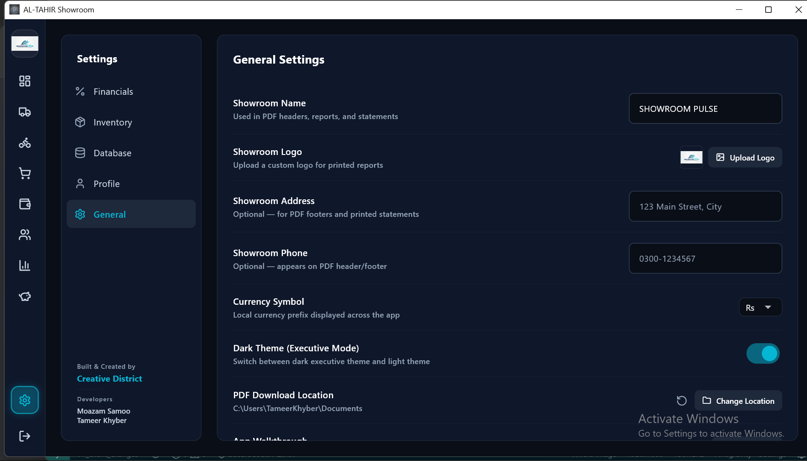
**Expanded Description & Component Usage Flow:**
This is the 'Settings' area where the core behavior of the entire application is configured, organized into a comprehensive Category Sidebar.
- **Category Sidebar Navigation:** A vertical menu allowing switching between Financials, Inventory, Database, Profile, and General settings.
- **Financials Configuration:** Contains highly sensitive inputs defining the business's operational physics. Features a 'Markup Slider' to set the 'Default Installment Markup' percentage pre-filled in new contracts. Also includes an 'Automatic Late Fee' toggle switch and percentage field to autonomously penalize overdue clients.
- **Inventory Configuration:** Provides interfaces to manage global 'Bike Brands' and 'Bike Models'. Adding brands here instantly updates the autocomplete dropdown options in the Add Bike/Add Stock forms.
- **Profile & General:** Allows the admin to set the 'Owner Name' and upload an 'Owner Profile Picture' using a local file picker. This personalizes the Dashboard greeting. A 'Replay App Tour' button allows users to manually re-trigger the instructional coach marks overlay.
- **Database Backup & Restore:** Critical safety features. The 'Export Database' button triggers an intensive background archiving routine, safely packaging the entire current state of the `.isar` database for external storage. The 'Import & Restore' button allows the user to browse their OS file system, select a previously saved backup file, and forcibly overwrite the current state.
- **Save/Update Behavior:** As changes are made in these tabs, they are synchronized to the local storage. If inputs are missing or invalid (e.g., setting a late fee of "ABC"), the settings form will invalidate and notify the user to correct the inputs before applying the business rules.

**Technical Implementation:** Functioning as the administrative control plane, this module dictates the ERP's core operational physics (e.g., EMI rounding rules). Critically, it executes a rigorous `archive` routine, enabling the secure exportation and restoration of `.isar` database states, guaranteeing absolute data preservation and business continuity for the enterprise.
